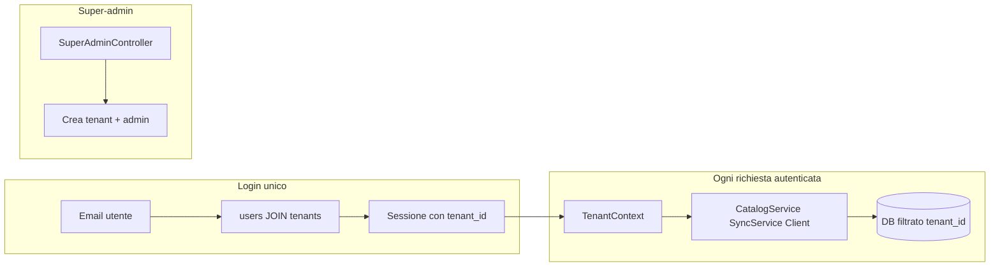

# Piano di conversione multi-tenant PutMio

> **Stato:** pianificato — non ancora implementato.  
> Documento di riferimento per la conversione futura da istanza singola a piattaforma multi-tenant.

## Decisioni architetturali (confermate)

| Scelta | Decisione |
|--------|-----------|
| Identificazione tenant | **Login unico** — stessi URL per tutti; al login l'email risolve il tenant e carica solo i suoi contenuti |
| Onboarding | **Super-admin centrale** crea i tenant e i rispettivi admin |
| Modello dati | **Shared database, shared schema** con colonna `tenant_id` (approccio row-level) |
| Compatibilità | L'istanza attuale diventa **tenant #1** (default) senza perdita dati |



---

## Checklist implementazione

- [ ] **Fase 0** — Feature flag `multi_tenant` in config + questo documento
- [ ] **Fase 1** — Schema `tenants` / `tenant_settings` + `tenant_id` + migrazione tenant default
- [ ] **Fase 2** — `TenantContext`, `TenantResolver`, estensione `Config` e `Session`
- [ ] **Fase 3** — Refactor `Client`, `SyncService`, `CatalogService`, `StreamProxy`
- [ ] **Fase 4** — `SuperAdminController`, UI gestione tenant, wizard install
- [ ] **Fase 5** — Storage poster isolato per tenant
- [ ] **Fase 6** — Test isolamento cross-tenant (8 scenari critici)
- [ ] **Fase 7** — Go-live, attivazione flag, rollback

---

## Fase 0 — Documentazione e feature flag (prima di toccare i dati)

Introdurre un flag in `config.php` / `config.example.php`:

```php
'app' => [
    'multi_tenant' => false,  // true solo dopo migrazione completata
]
```

Finché `multi_tenant === false`, il comportamento resta identico a oggi. Questo permette di sviluppare e testare senza rischi in produzione.

---

## Fase 1 — Schema database e migrazione tenant default

### Nuove tabelle

**`tenants`**
- `id`, `slug` (opzionale, per uso interno), `name`, `status` (`active`/`suspended`), `created_at`
- `encryption_key` (per token put.io cifrati per tenant)
- `cron_token` (per sync isolata)
- `timezone`, `stream_*` settings opzionali

**`tenant_settings`** (alternativa: colonne JSON su `tenants`)
- `putio_client_id`, `putio_client_secret_enc`, `tmdb_api_key`, `smtp_*` — tutto ciò che oggi è globale in `Installer::writeConfig()` e `AdminController::saveSettings()`

### Colonna `tenant_id` sulle tabelle esistenti

Obbligatoria su (`sql/schema.sql`):

| Tabella | Note |
|---------|------|
| `users` | Ruolo esteso: `super_admin`, `tenant_admin`, `user` |
| `putio_connection` | Rimuovere singleton `id=1`; PK `tenant_id` o `(tenant_id)` unique |
| `putio_sync_friends`, `putio_files`, `media_items` | Scope completo |
| `genres`, `tags` | Per-tenant (evita collisioni nomi) |
| `invites`, `stream_sessions`, `audit_log`, `stream_daily_stats` | Scope completo |

**Senza `tenant_id` diretto** (scoped via FK):
- `watch_progress` → via `user_id`
- `password_resets` → via `user_id`
- `media_genres`, `media_tags` → via `media_id`

### Vincoli univoci da aggiornare

- `users.email`: da `UNIQUE(email)` a `UNIQUE(tenant_id, email)` — email super-admin può avere `tenant_id = NULL`
- `putio_files.putio_id`: da globale a `UNIQUE(tenant_id, putio_id)`
- `putio_sync_friends`: `UNIQUE(tenant_id, putio_friend_id)`

### Migrazione dati esistenti (script in `Migrator`)

1. Creare tenant `default` (id=1, name dall'installazione)
2. `UPDATE` tutte le righe esistenti con `tenant_id = 1`
3. Copiare da `config.php` globale → `tenant_settings` del tenant #1 (putio, tmdb, smtp, cron_token, encryption_key)
4. Trasformare l'admin installazione in `tenant_admin` del tenant #1
5. Creare utente `super_admin` (nuovo step install o comando post-migrazione)

---

## Fase 2 — TenantContext (cuore dell'isolamento)

Nuovo modulo `src/Tenant/`:

### `TenantContext` (request-scoped singleton)
- `id(): ?int` — null solo per super-admin fuori da un tenant
- `requireId(): int` — lancia eccezione se mancante
- `settings(): array` — carica da `tenant_settings` con cache request
- `encryptionKey(): string`

### `TenantResolver`
- **Login**: `AuthService::attempt()` — `SELECT ... FROM users u JOIN tenants t ON t.id = u.tenant_id WHERE u.email = ? AND t.status = 'active'`
- **Sessione**: `Session::login()` aggiunge `$_SESSION['tenant_id']`
- **Super-admin impersonation** (opzionale fase 2b): `?as_tenant=` solo per super-admin con audit log

### `Config` esteso
- `Config::get('putio.client_id')` → se `TenantContext` attivo, legge da `tenant_settings`; altrimenti da `config.php` (fallback pre-migrazione)
- Stesso pattern per `tmdb.*`, `smtp.*`, `app.cron_token`, `app.encryption_key`

---

## Fase 3 — Refactor servizi (query sempre scoped)

Ordine consigliato (dal più critico al più periferico):

### 3.1 Put.io — `Client.php`
- Costruttore: `new Client(?int $tenantId = null)` — default da `TenantContext`
- Sostituire `WHERE id = 1` con `WHERE tenant_id = ?`
- OAuth: in `putioCallback()` usare `TenantContext` dalla sessione admin

### 3.2 Sync — `SyncService.php`, `FriendService.php`
- Tutte le INSERT/UPDATE/DELETE con filtro `tenant_id`
- `pruneMissingOnPutio()` non deve mai fare DELETE globale

### 3.3 Catalogo — `CatalogService.php`, `SeriesGrouper.php`
- Aggiungere `AND mi.tenant_id = ?` in ogni query
- `helpers.php` `putmio_admin_nav_stats()` — scoped al tenant

### 3.4 Streaming — `StreamProxy.php`, `PlayerController.php`
- `assertCanStream()`: verificare che il file appartenga al tenant dell'utente
- `terminateAllActive()`: solo sessioni del tenant corrente
- `CatalogController::poster()`: validare che il poster appartenga a media del tenant (oggi è pubblico senza auth — rischio cross-tenant)

### 3.5 Admin — `AdminController.php`
- `Session::requireAdmin()` → `requireTenantAdmin()` (admin del proprio tenant)
- Dashboard, utenti, classificazione: filtro `tenant_id`
- Inviti: `created_by` + `tenant_id` su `invites`

### 3.6 API interne — `ApiController.php`
- `tmdbApply`, `putioSync`: verificare che `media_id` appartenga al tenant della sessione

### 3.7 Cron — `CronController.php`
- URL: `GET /cron/sync?token=TOKEN` — il token identifica il tenant (non più un token globale)
- Loop su tutti i tenant attivi se si vuole un cron unico lato OVH, oppure un URL per tenant

---

## Fase 4 — Super-admin e gestione tenant

Nuovo controller `SuperAdminController` + template (stile `DESIGN.md`):

| Route | Azione |
|-------|--------|
| `GET /superadmin` | Dashboard: lista tenant, stato, ultimo sync |
| `GET /superadmin/tenanti/nuovo` | Form creazione tenant |
| `POST /superadmin/tenanti` | Crea tenant + `tenant_admin` (email, nome, password temporanea) |
| `POST /superadmin/tenanti/{id}/sospendi` | `status = suspended` — blocca login utenti del tenant |
| `GET /superadmin/tenanti/{id}` | Dettaglio: utenti, connessione put.io, statistiche |

**Auth**: `Session::requireSuperAdmin()` — ruolo `super_admin`, `tenant_id IS NULL`.

### Wizard installazione aggiornato

`InstallController` / `Installer`:
- Step 5: crea **super-admin** (non più tenant admin)
- Step 6: crea **tenant default** + primo `tenant_admin`
- Aggiornare `README.md` con flusso installazione e cron per-tenant

---

## Fase 5 — Storage isolato

| Risorsa | Path attuale | Path multi-tenant |
|---------|--------------|-------------------|
| Poster | `storage/posters/media_{id}.jpg` | `storage/tenants/{tenant_id}/posters/media_{id}.jpg` |
| Log | `storage/logs/app.log` | `storage/logs/tenant_{id}.log` (opzionale) |
| Sessioni PHP | `storage/sessions/` | Invariato (tenant in `$_SESSION`) |

Aggiornare `TMDB\Client::downloadPoster()` e migrazione file esistenti per tenant #1.

---

## Fase 6 — Controlli di isolamento (security checklist)

### 6.1 Helper

```php
// helpers.php o src/Tenant/QueryScope.php
function putmio_tenant_where(string $alias = ''): string
function putmio_assert_tenant_row(?array $row, int $expectedTenantId): void
```

### 6.2 Controlli obbligatori per endpoint

| Endpoint | Controllo |
|----------|-----------|
| `/stream?id=` | `putio_files.tenant_id === session.tenant_id` |
| `/poster?f=` | media del tenant (o auth + check) |
| `/catalogo/*`, `/titolo/*` | query con `tenant_id` |
| `/api/watch-progress` | `media_id` ∈ tenant utente |
| Admin sync/disconnect | solo tenant della sessione |
| Cron | token → tenant, sync solo quel tenant |

### 6.3 Test di regressione isolamento (prima del go-live)

Script o PHPUnit in `tests/TenantIsolationTest.php`:

1. **Cross-tenant media**: utente tenant A non vede catalogo tenant B
2. **Cross-tenant stream**: ID put.io di tenant B → 403 per utente tenant A
3. **Cross-tenant poster**: basename di tenant B → 404 per tenant A
4. **Cross-tenant admin**: tenant_admin A non modifica media di B
5. **Suspended tenant**: login bloccato, stream terminati
6. **Email collision**: stessa email su due tenant → login corretto per ciascuno
7. **Cron token**: token tenant A non sincronizza tenant B
8. **OAuth**: callback salva token sul tenant della sessione admin, non su altri

### 6.4 Audit

Attivare scritture su `audit_log` (oggi schema only):
- Login/logout con `tenant_id`
- Super-admin: creazione/sospensione tenant
- put.io connect/disconnect per tenant

---

## Fase 7 — Attivazione e rollback

### Sequenza go-live

1. Backup DB + `config.php` + `storage/`
2. Deploy codice con `multi_tenant = false`
3. Eseguire migrazione DB (Fase 1) via `Migrator`
4. Verificare tenant #1 funziona identico a prima
5. Creare super-admin
6. Test checklist Fase 6 su staging
7. Impostare `multi_tenant = true`
8. Creare secondo tenant di prova e ripetere test

### Rollback

- `multi_tenant = false` ripristina lettura da `config.php` globale
- Tenant #1 mantiene tutti i dati originali
- Non eliminare colonne `tenant_id` finché non si è stabili

---

## File principali da modificare

| Area | File |
|------|------|
| Schema | `sql/schema.sql`, `src/Database/Migrator.php` |
| Tenant core | `src/Tenant/TenantContext.php`, `TenantResolver.php`, `TenantSettings.php` (nuovi) |
| Auth | `src/Auth/AuthService.php`, `Session.php`, `AuthController.php` |
| Put.io | `src/PutIO/Client.php`, `SyncService.php`, `FriendService.php` |
| Catalogo/Stream | `src/CatalogService.php`, `StreamProxy.php`, `SeriesGrouper.php` |
| Admin | `src/Controllers/AdminController.php`, `SuperAdminController.php` (nuovo) |
| Router | `src/Router.php` |
| Install | `src/Install/Installer.php`, `InstallController.php` |
| UI | `templates/superadmin/*`, `templates/admin/*` |
| Docs | `README.md`, questo file |

---

## Stima effort (indicativa)

| Fase | Complessità | Dipendenze |
|------|-------------|------------|
| 0–1 Schema + migrazione | Media | Nessuna |
| 2 TenantContext | Media | Fase 1 |
| 3 Refactor servizi | Alta | Fase 2 |
| 4 Super-admin UI | Media | Fase 2 |
| 5 Storage | Bassa | Fase 1 |
| 6 Test isolamento | Media | Fase 3 |
| 7 Go-live | Bassa | Tutte |

**Totale stimato**: refactor sostanziale (~70% del codebase che tocca il DB), ma incrementale e reversibile grazie al feature flag e al tenant default.

---

## Fuori scope (fase futura opzionale)

- API REST pubbliche per tenant (API key, rate limit)
- Self-registrazione tenant
- Subdomain/path per tenant (non richiesto: login via email)
- Database separato per tenant (overkill per OVH shared hosting)
